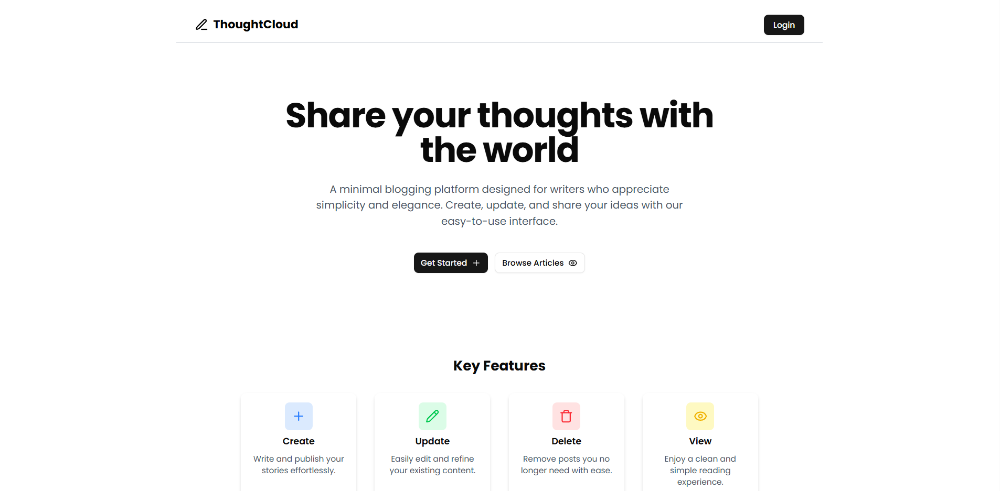

# ThoughtCloud - Your Personal Blogging Platform

**ThoughtCloud** is a modern personal blogging website that empowers you to easily create, view, update, and delete your blog posts. Built with a focus on simplicity and a smooth user experience, it provides all the essential tools you need to share your thoughts online.

## Features

* **View Blogs:** Browse and read your published blog posts.
* **Create Blogs:** Write and publish new blog entries seamlessly.
* **Update Blogs:** Edit your existing blog posts to make changes and improvements.
* **Delete Blogs:** Remove blog posts that you no longer want to keep.
* **Responsive Design:** The website is designed to look and function well on various screen sizes.
* **Modern UI:** A clean and intuitive user interface powered by Shadcn UI.
* **Smooth Animations:** Engaging user experience with Framer Motion.
* **Secure Authentication:** Backend utilizes JSON Web Tokens (JWT) for secure user authentication.
* **Centralized State Management:** Frontend utilizes Zustand for efficient and scalable state management.

## Tech Stack
**Frontend:**

* **React (TypeScript):** A JavaScript library for building user interfaces with type safety.
* **Tailwind CSS:** A utility-first CSS framework for rapid styling.
* **Shadcn UI:** A collection of reusable UI components built using Radix UI and Tailwind CSS.
* **Framer Motion:** A powerful animation library for React.
* **Zustand:** A small, fast, and scalable bearbones state-management solution.

**Backend:**

* **Node.js:** A JavaScript runtime environment for building server-side applications.
* **Express.js:** A minimal and flexible Node.js web application framework.
* **MongoDB:** A NoSQL database for storing blog post data.
* **Prisma:** A next-generation ORM for Node.js and TypeScript, providing type-safe database access.
* **jsonwebtoken:** Used for implementing secure authentication via JSON Web Tokens.

**Deployment:**

* **Vercel:** Used for hosting the frontend React application.
* **Render:** Used for hosting the backend Node.js/Express API.